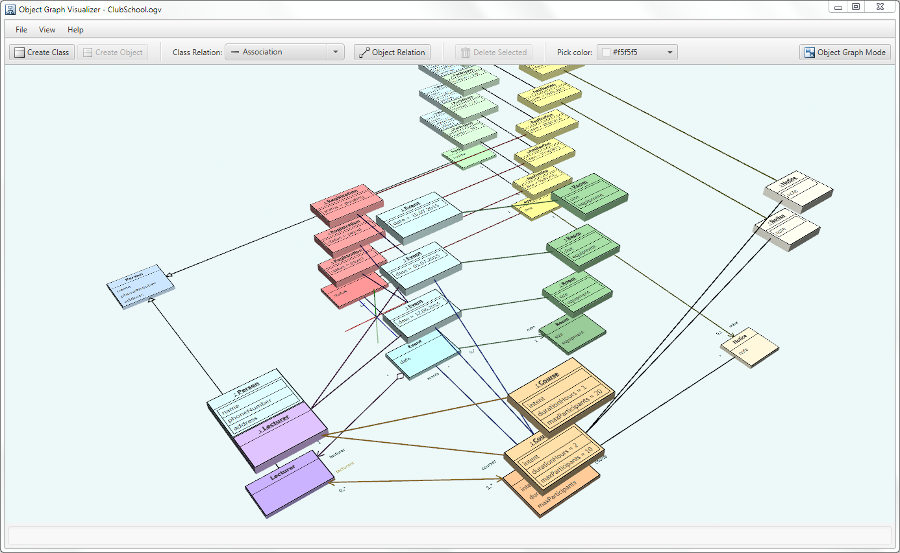
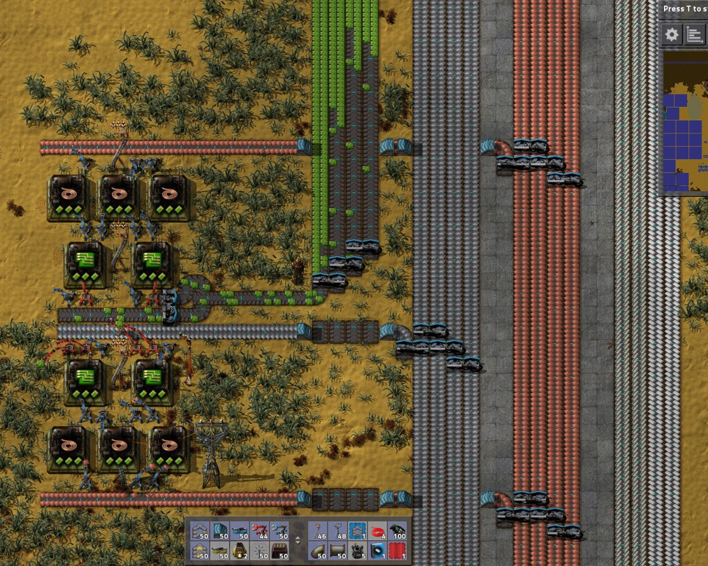

# Procedural Programming HOWTO

It's been about ten years since I published some [critiques of Object-Oriented Programming](./oop_is_bad.md), and I've since resisted revisting the topic until I have some new thoughts or or a useful reformulation of the argument. Well now I'm ready to beat the dead horse again, though only briefly and hopefully for the last time.

My previous efforts perhaps didn't make the alternative to OOP totally clear, so what follows will be:

1. A quick restatement of the problems with OOP.
2. A high-level explanation of what I consider good ways to structure code and data, which for lack of a better term, we'll call "procedural programming".

## OOP performance issues

One angle of critique I didn't actually cover in my original videos is the performance angle. Others have covered this angle thoroughly, but I've also written a brief summary of the problems in an appendix of the [Unity DOTS E-book](https://unity.com/resources/introduction-to-dots-ebook). Quoting from myself:

> ...OOP tends to incur a number of performance costs:
> 
> - **Scattered data layout**: OOP code is often split into many small objects, and the data often ends up scattered throughout memory (which leads to cache inefficiencies)
> - **Bad allocation patterns**: The complex code paths and tangled data relationships that OOP encourages often make it difficult to reason about object lifetimes, so OOP code tends to rely upon frequent, small allocations and garbage collection rather than more efficient alternatives
> - **Excessive abstraction**: Object-oriented design often encourages layers of delegation, where the higher levels defer the real work to lower levels, resulting in many objects and methods that do little actual work
> - **Complex call chains**: Thanks to the many layers of abstraction and a preference for small functions, call chains get very complex
> - **Virtual calls**: Not only do virtual dispatch tables incur overhead over regular function calls, virtual calls cannot normally be inlined (though some JIT compilers may do so at runtime)
> - **One-at-a-time processing**: Because the code which directly manipulates an object is part of the object itself, there’s a natural tendency in OOP to process objects one-by-one rather than in large batches

## OOP structural issues

The same appendix also discusses structural issues with OOP, but I'll try to reduce the argument here down to two main problems:

### 1) Overenthusiasm for fine-grained modularity

Dividing large systems into encapsulated modules is a perfectly good idea and perhaps even essential at a certain scale, but OOP takes the idea way too far, *i.e.* 'If modules are good, then maybe everything should be a module, and maybe more modules are always better!'

The underlying premise is that, the smaller a module, the easier a module can be made correct. In itself, this is totally true. The mistake is forgetting that the correctness of the whole system resides in how the modules interrelate, not just the correctness of the individual modules. By forgetting this, OOP often ends up replacing concentrated complexity with scattered complexity&mdash;which is generally more difficult to reason about&mdash;and thus ends up increasing overall complexity.

> [!NOTE]
> A related structural problem of OOP is 'conflation of data types with modules', the insistence that every data type be its own module and that all modules are data types. This conflation often leads to unnecessary fracturing of code and data across odd boundaries, *e.g.* relocating data from one object to another because it doesn't fit the supposed 'single responsibility' of the object.
>
> Arguably, though, this mistake is all just downstream of the OOP mania for fine-grained modularity. In origin, the thinking was probably something like:
>
> 1. some data types *do* make for naturally self-contained modules (such as ADTs)
> 1. a program's data types are typically numerous and small enough to seem like plausible boundary lines for fine-grained modules
>
> Hence, the conflation may have seemed like a plausible idea in the 1970s.

### 2) Aversion to sequential code and flat data

The second major problem with object-oriented design is its strong tendency to result in ping-pong call graphs and tangles of cross-referenced data. These follow naturally from the excessive modularity: because the objects are small and self-contained, they can do little on their own and so tend to collect more-and-more direct and indirect references to other objects; then, to get anything done, the methods of an object must invoke the methods of other objects which must invoke the methods of other objects which must invoke the methods of other objects...

As I'll argue in the rest of this post, over-complicating the shape of your code and data in this way&mdash;straying from simple, sequential code and simple, flat data&mdash;makes your program much harder to understand and often much more difficult to optimize.

## Data transformation pipelines

The primary mental model in OOP is a graph of objects with potentially arbitrary connections. Summed up as a metaphor:

> ***An object-oriented program is a zoo of cooperating objects.***

In contrast, the primary mental model in procedural programming is sequential data transformation:

> ***A procedural program is an assembly line that transforms data.***

Data is loaded at one end of the assembly line, various stations along the line manipulate the data, and then the transformed data comes out the other end.

*[An axiomatic truth](https://www.youtube.com/watch?v=rX0ItVEVjHc)*

Not everything may *seem* like a data transformation problem, but if something is computable, it is ultimately just that. In fact, programs can be broadly categorized by the primary kind of data transformation they perform:

- **Servers** transform network requests into network responses.
- **Interactive applications** transform the application's state into new states based on user input events.
- **Simulations** (such as games) transform the simulation's states into new states based on user input and clock ticks.
- **Processing jobs** (such as command line utils and compilers) transform arguments and file data into some result, then save or print the result before terminating.

These four categories cover basically every program ever written (excepting arguably operating systems and embedded systems, which both can be broadly said to transform data into control of physical devices).

In principle then, writing correct programs is just a matter of correctly transforming data! So writing any program should be easy, right? Well, some data transformations are very, very complicated, but this is where the assembly line model pays off:

> **If the correct data is fed into the assembly line but the wrong thing comes out the other end, you can simply bisect the sequence to figure out where it goes wrong.**

This works recursively: if stages A, B, and C produce correct results but stage D does not, you know the problem lies somewhere in D and can bisect the substages of D in the exact same way.

In contrast, a zoo of cooperating objects is not designed to be reasoned about sequentially: 

1. Objects have responsibilities and relationships which in theory add up to correct programs.
2. If the program fails, perhaps an object is failing to fulfill its responsibilities correctly, or perhaps the responsibilities and relationships need to be redesigned (maybe a method should be added, or a method should be moved to a different object, or whole new objects should be created, *etc.*).
3. How the objects coordinate is not modeled as a sequence: object graphs are deliberately freeform.
4. Sequential flows may be easy to trace in some simpler object graphs, but only incidentally. As graphs accrue more objects, simple code paths typically get scrambled because object-oriented design does not prioritize sequential reasoning.

To be fair, even though sequential data pipelines are inherently easier to reason about, they are not immune to their own overcomplications. In particular, data pipelines may suffer from:

1. Scattered access of mutable state
1. Functions that access too much external state
1. Unnecessarily complex data

## Scattered access of mutable state

Shared state infamously complicates multi-threading, but it also can over-complicate single-threaded code if wrecklessly scattered through the code. Say a piece of data comes out wrong at the end of your data pipline. Where did it go wrong? Well the more substages in the pipeline where the data gets potentailly mutated, the harder you'll have to look and the harder you'll typically have to reason about the fix.

If you flip the perspective and think first about data before code, the fewer places in code where a piece of data gets potentailly mutated, generally the much easier it is to understand that data and what purpose it serves. In fact, pervasively mutating a piece of data througout the pipeline sneakily embues it with multiple stealth purposes that shift from stage to stage.

How can this be combated? Well in ideal cases, you can consolidate mutations of a particular piece of data into just one or a few part of the pipeline. Often all this takes is just a bit of reordering the logic.

When this isn't possible, a fallback option in some cases is to create transient copies rather than mutate the original. This isn't really a simplification, *per se*, but it can make the code more honest: what before was just called 'foo' at all stages of the pipeline even though its purpose changes stage-to-stage, now its role is filled in parts by transient copy 'foo prime', which better signals intent to readers. What was presented as *one* thing in the pipeline is more truthfully presented as multiple related things. Even though you now have another named thing to think about, the explicit distinction still provides better clarity.

### Functions that access too much external state

When functions access external state, they are not self-contained and thus can be much harder to reason about.

If all the external state accessed by a function were declared at the top of the function, this would at least notify the programmer , but even better if the function simply accesses less external state to begin with or even none at all.

The correct mindset is to consciously delineate functions based on what categories of external state they access, directly or indirectly. Take stock of whether each function:

- reads globals
- writes globals
- reads from I/O devices
- writes to I/O devices
- mutates data passed by reference 

Then for each case, examine whether it's really necessary:

- Does this function really need to read a global? Maybe it can instead be passed a transient copy.
- Does this function really need to write to a file? Maybe the function can write the data to memory and leave it up to later code to eventually write out to a file.
- Does this function really need to mutate the data passed to it by reference? Maybe it can instead return its results as a new, separate value.

Much like the general strategy of consolidating state mutations, the goal is to not eliminate these things but rather concentrate them into fewer points of the pipeline. Full functional purity is a big ask with downsides of its own, but you win a lot just aiming for the next step down:

- **Functions should only access data that is explicitly passed to them.** No function should read or write globals.
- **Functions should only be passed data that they actually need.** Large collections and structs should not be passed when individual items or fields will suffice.
- **Core logic should not be mixed with I/O.** Functions that do core logic should not do I/O, and functions that do I/O should not do non-trivial logic.

> [!NOTE]
> Loggers and allocators are technically stateful, but generally not in ways that can break the logic of your program. Hence they're OK to access as globals.

Annoyingly, there doesn't seem to be an established term for functions that may mutate their arguments but which are not otherwise pure. I'd try to coin something, but there aren't any obvious candidates. "Semi-pure"? "Quasi-pure"? Gemini suggests "transluscent" (as in 'referentially transparent'). Whatever you want to call it, the idea is simple: just try to minimize the scope of external state accessed by each function.

## Unnecessarily complex data

The best data designs are usual simple (if not neccessarily the *simplest*). When data is more complex than it needs to be:

- The purpose of the data elements become harder to understand.
- The program becomes harder to change.
- State mutation becomes more difficult to consolidate within the pipeline.

To this last point, consider if instances of data type A reference instances of data type B: any access of A then implies access of B, and so consolidating state mutation of B requires also minding access of A. Conversely, if the linkage can be removed, managing and optimizing both A and B independently becomes easier. Sometimes, of course, you need such linkages&mdash;but often you don't!

A key sin of object-oriented thinking is that it encourages you to design your data around your code, and so the data tyically ends up with many such unnecessary relationships, fractures, and redundancies. In procedural programming, you have the freedom to question your data design on its own terms before even thinking about code, *e.g.*:

- Is this the most minimal, compact encoding of the required information? If not, do we have good reason to denormalize?
- Are these linkages necessary? If so, can the linkages be represented by keys or indexes instead of pointers?
- Does this data need to be stored at all, or can it just be inferred or recomputed as needed?
- Can these hierarchies or graphs be flattened into arrays?

## Context confusion

Unfortunately, one more thing prevents the data pipeline model from making all computable problems entirely simple and easy to solve: the *context*. While a pipeline is the most tractable way to reason about the relationships of all the data and code within the pipeline, there still remains the relationship of the pipeline to the outside world.

As established earlier, servers are basically request processing pipelines, interactive applications are event processing piplines, and games are user input processing pipelines; in principle then, as long as the core pipelines of these programs transform the program state correctly for every possible request, event, or user input, then the programs will work correctly. However, this is often easier said then done because:

1. The pipeline must robustly anticipate all possible sequences of requests, events, and user input.
2. Some request, event, or input sequences may require the program to store complex transitory states.

For example, in a user application, when events trigger longer-running async tasks, this may necessitate blocking some but not all user interactions until the task is complete. For another example, in a game, a scripted sequence that plays out over many frames must often account for many possible user actions while the sequence plays out and other facets of world state. The logic for these cases cannot be contained within any single run of an application's pipeline (the event handlers) or a game's pipeline (the tick update), and so they often require complex state representation and careful thinking.

Exacerbating the difficulty of these cases is the fact that testing and debugging code across multiple events or multiple game ticks is generally much less straightforward than testing or debugging within a single event handler or a single game tick. An ordinary step debugger is not sufficient: debugging such cases properly requires the ability to record and playback events and input. (Sadly this capability is not commonly available in widely used application frameworks and game engines.)