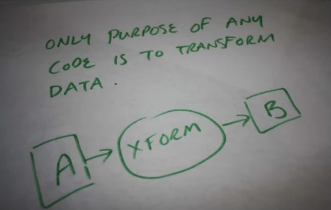

# Procedural Programming HOWTO

It's been about ten years since I published [my critiques of Object-Oriented Programming](./oop_is_bad.md), and I've since resisted revisting the topic until I have some new thoughts or or a useful reformulation of the argument. Well now I'm ready to beat the dead horse again, though only briefly and hopefully for the last time.

My previous efforts perhaps didn't make the alternative to OOP totally clear, so what follows will be:

1. A quick restatement of the problems with OOP.
2. A high-level explanation of what I consider good ways to structure code and data, which for lack of a better term, we'll call "procedural programming".

## OOP performance issues

One angle of critique I didn't actually cover in my original videos is the performance angle. Others have covered this angle thoroughly, but I've also written a brief summary of the problems in an appendix of the [Unity DOTS E-book](https://unity.com/resources/introduction-to-dots-ebook). Quoting from myself:

> ...OOP tends to incur a number of performance costs:
> 
> - **Scattered data layout**: OOP code is often split into many small objects, and the data often ends up scattered throughout memory (which leads to cache inefficiencies)
> - **Bad allocation patterns**: The complex code paths and tangled data relationships that OOP encourages often make it difficult to reason about object lifetimes, so OOP code tends to rely upon frequent, small allocations and garbage collection rather than more efficient alternatives
> - **Excessive abstraction**: Object-oriented design often encourages layers of delegation, where the higher levels defer the real work to lower levels, resulting in many objects and methods that do little actual work
> - **Complex call chains**: Thanks to the many layers of abstraction and a preference for small functions, call chains get very complex
> - **Virtual calls**: Not only do virtual dispatch tables incur overhead over regular function calls, virtual calls cannot normally be inlined (though some JIT compilers may do so at runtime)
> - **One-at-a-time processing**: Because the code which directly manipulates an object is part of the object itself, there’s a natural tendency in OOP to process objects one-by-one rather than in large batches

## OOP structural issues

The same appendix also discusses structural issues with OOP, but I'll try to reduce the argument here down to two main problems:

### 1) Overenthusiasm for fine-grained modularity

Dividing large systems into encapsulated modules is a perfectly good idea and perhaps even essential at a certain scale. OOP takes the idea way too far: 'If modules are good, then maybe everything should be a module, and maybe more modules are always better?'

The underlying premise is that, the smaller a module, the easier a module can be made correct. In itself, this is totally true. The mistake is forgetting that the correctness of the whole system resides in how the modules interrelate, not just the correctness of the individual modules. By forgetting this, OOP often ends up replacing concentrated complexity with scattered complexity&mdash;which is generally more difficult to reason about&mdash;and thus increasing overall complexity.

> [!NOTE]
> A related structural problem of OOP is 'conflation of data types with modules', the insistence that every data type be its own module and that all modules are data types. This conflation often leads to unnecessary fracturing of code and data across odd boundaries, *e.g.* relocating data from one object to another because it doesn't fit the supposed 'single responsibility' of the object.
>
> Arguably, though, this mistake is all just downstream of the OOP mania for fine-grained modularity. In origin, the thinking may have been that:
>
> - first, some data types *do* make for naturally self-contained modules
> - second, a program's data types are typically numerous and small enough to seem like plausible boundary lines for fine-grained modules
>
> Hence, this conflation seemed like a good idea.

### 2) Aversion to sequential code and flat data

The second major problem with object-oriented design is its strong tendency to result in ping-pong call graphs and tangles of cross-referenced data. These follow naturally from the excessive modularity: because the objects are small and self-contained, they can do little on their own and so tend to collect more-and-more direct and indirect references to other objects, and then to get anything done, the methods of an object must invoke the methods of other objects which must invoke the methods of other objects which must invoke the methods of other objects...

As I'll argue in the rest of this post, over-complicating the shape of your code and data in this way&mdash;straying from simple, sequential code and simple, flat data&mdash;makes your program much harder to understand and often much more difficult to optimize.

## Data transformation pipelines

The primary mental model in OOP is a graph of objects with potentially arbitrary connections. Summed up as a metaphor:

> ***An object-oriented program is a zoo of cooperating objects.***

In contrast, the primary mental model in procedural programming is sequential data transformation:

> ***A procedural program is an assembly line that transforms data.***

Data is loaded at one end of the assembly line, various stations along the line manipulate the data, and then the transformed data comes out the other end.

*Axiomatic truth*

Not everything may *seem* like a data transformation problem, but everything computable ultimately must be so. In fact, programs can be broadly categorized by the primary kind of data transformation they perform:

- **Processing jobs** (such as command line utils and compilers) transform arguments and file data, then save or print the results before terminating.
- **Servers** transform network requests into network responses.
- **Interactive applications** transform the application's state into new states based on user input events.
- **Simulations** (such as games) transform the simulation's states into new states based on user input and time deltas.

These four categories cover basically every program ever written, excepting arguably operating systems and embedded systems (which both can be broadly said to transform data into control of physical devices).

In principle then, writing correct programs is just a matter of correctly transforming data! So writing any program should be easy, right? Well, the most obvious problem is that some data transformations are very, very complicated, but this is where the assembly line model pays off:

> **If the correct data is fed into the assembly line but the wrong thing comes out the other end, you can simply bisect the sequence to figure out where it goes wrong.**

The model is recursively decomposable: if stages A, B, and C produce correct results but stage D does not, you know the problem lies somewhere in D and can drill down into the substages of D in the exact same way.

In contrast, a zoo of cooperating objects is not designed to be reasoned about sequentially: 

1. Objects have responsibilities and relationships which in theory add up to correct programs.
2. If the program fails, perhaps an object is failing to fulfill its responsibilities correctly, or perhaps the responsibilities and relationships need to be redesigned: maybe a method should be added, or moved, or whole new objects created, *etc.*.
3. How the objects coordinate is not modeled as a sequence: object graphs are deliberately freeform.
4. Sequential flows may be easy to trace in some simpler object graphs, but only incidentally. As graphs accrue more objects, simple code paths typically get scrambled because object-oriented design does not prioritize sequential reasoning.

To be sure, not everything is perfect on the assembly line either.

factorio bus
assembly line

- in interactive programs and simulations, the application or simulation state may not fully or correctly model all of the desired states. (Transitory states can be especially tricky to get right)
- in interactive programs and simulations, the data transformation may seem correct for handling individual events but then break upon certain unusual sequences of input; in other words, everything within the logic of the frame may seem fine, but then the logic may be broken for what happens between frames

clean macro > clean micro

an individual function is a mini-pipeline
    macro-structure that most closely mirrors the one proven unit of code abstraction: the function

game loop
    compilcation: 
        complex state carried from tick-to-tick

UI events
    complication:
        anticipate all possible event sequences
            particularly troublesome for long-running, async event handlers

servers
    compilication:
        overlapping requests

data pipeline spaghetti
    still have to worry about sequencing of how the pipeline is fed:
        event sequences
        logic over multiple frames in game loop
            cannot be captured by the pipeline that defines the frame

## Good function design

- no mutation of argument data
- no read of globals
- no write of globals
- no i/o
- no alloc
- no sync
- no coloring (async or otherwise)
- no exceptions
- no returned errors? (ideally keep failure paths out of core logic...but not always possible; keeping IO out of core logic paths already removes a big chunk of likely failure paths from most code)

shallow call stacks

minimize scope of data access
    don't pass in things that aren't actually needed
    the larger the scope of data accessed by a function, the simpler its direct logic should be (farm out work to helper functions)
    data scope should generally narrow as you go further down the call stack

    using globals or passing more than you actually need makes it hard to audit the codebase when you need to know:
        1. what data is touched by a certain piece of code?
        2. what parts of code touch a certain piece of data?

loggers and allocators are a special exemption for rule against globals because you generally don't have to worry about their state (even though they are stateful): your code is not going to put a logger into a bad state

## Good data design

spectrum of persistent data to transitory data
    at very least, don’t store transitory state in globals
    pass minimal set of global state up the chain
        similar to argument about exceptions: hassle of returning errors up full chain

clean data > clean code

good usually = simple
    maybe not always simplest option, but generally simple

flat, minimize hierarchy and graphs

reference into structures by index/keys rather than address

avoid redundancies
    consider the minimal, most compact encoding of the information

## Sequences > hierarchies > graphs

common theme about both code design and data design

sometimes you do need hierarchies and graphs
    e.g. hierarchical data and distributed systems
    ...but avoid them when you can
        e.g. do you want to have to think about complex type hierarchies AND runtime object graph AND deep call stacks?
            classic Java style imposes this kind of burden

    ... when you do have hierarchies and graphs, try to keep them simple
        e.g. keep call stack shallow

# DISCARD

## Procedural mindset

- **Pessimistic about fine-grained modularization**:
- **Pessimistic about code reuse and abstractions**: solve just your specific, immediate problem rather than speculate about your future problems
- **Pessimistic about dependencies**:
- **Pessimistic about tools**: compilers / toolchains

tolerant of rewriting code
    exploratory problem solving
    not worried about future, just solve for the problem as currently defined (even if consciously truncated)
    don’t speculate about future needs
    if the requirements change, change the data/code
    good writing is rewriting

tolerant of some repetition
tolerant of data in code / code that resembles data
    repetition that could otherwise be extracted out with macros or other abstractions

APIs != normal code

3 Objects make it difficult to track which code accesses which data

purported advantages:

The theoretical benefits of OOP include:
— Composability: Programs made out of objects can be incrementally assembled and
modified
— Reconfigurability: Features can be easily added, removed, and modified by inserting,
removing, and replacing objects
— Code reuse: Objects can be easily reused between programs.
— Intuitiveness: Real-world things and processes naturally correspond to objects.
— Abstraction: Objects allow the programmer to solve problems at a high-level without
being distracted by low-level details